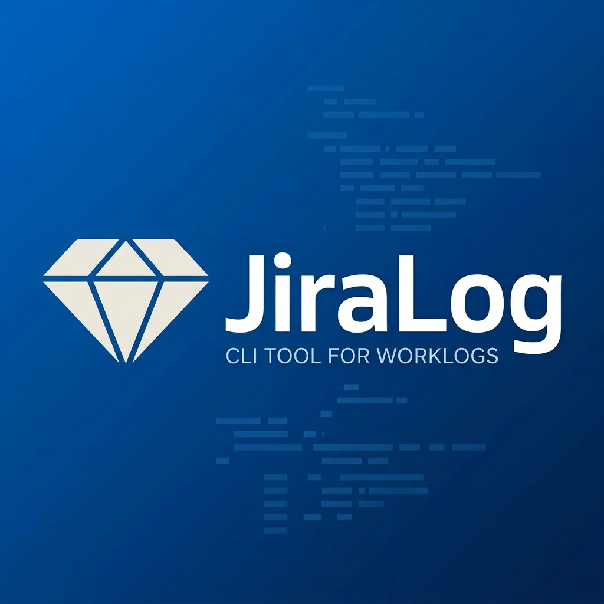

<div align="center">
  
  <h1>JiraLog</h1>
  <p>Автоматическая загрузка worklogs в Jira из JSON-логов таймера</p>
</div>

<p align="center">
  <a href="https://www.python.org/"></a>
  <a href="https://developer.atlassian.com/cloud/jira/platform/rest/v3/"></a>
  <a href="LICENSE"></a>
</p>

## Что это

JiraLog читает JSON-файл с записями таймера, группирует время по задачам и загружает worklogs в Jira через REST API.

- **Защита от дублей**

> Перед каждой записью скрипт проверяет, нет ли уже worklog с таким же комментарием и датой — повторный запуск безопасен.

- **Точное время**

> Jira усекает каждый worklog до целых минут. JiraLog компенсирует потери, округляя нужные записи вверх — итоговое время в Jira совпадает с реальным.

- **Dry-run режим**

> Запусти с `--dry-run`, чтобы увидеть что будет загружено, без реальных изменений в Jira.

## Установка

```bash
pip install requests colorama python-dotenv
```

Создай `.env` в корне проекта:

```env
JIRA_BASE_URL=https://yourcompany.atlassian.net
JIRA_USERNAME=your@email.com
JIRA_API_TOKEN=your_api_token
```

> Токен: [id.atlassian.com/manage-profile/security/api-tokens](https://id.atlassian.com/manage-profile/security/api-tokens)

## Использование

```bash
python jiralog.py            # выбор файла из списка, реальная загрузка
python jiralog.py --dry-run  # симуляция без записи в Jira
```

При запуске скрипт покажет список файлов из `logs/` и предложит выбрать нужный:

```
📁 Доступные файлы:
 1️⃣  12.03.2026.json
 2️⃣  11.03.2026.json
 ➡️  Введите номер файла:
```

## Формат JSON-файла

Файлы должны лежать в `logs/` и называться по дате: `DD.MM.YYYY.json`.

```json
{
  "laps": [
    { "lapId": 1, "diff": 393394,  "text": "PROJ-1 StandUp" },
    { "lapId": 2, "diff": 1408876, "text": "PROJ-42 QA" },
    { "lapId": 3, "diff": 5498295, "text": "PROJ-42 QA" }
  ]
}
```

| Поле   | Описание |
|--------|----------|
| `diff` | Время в миллисекундах |
| `text` | `ISSUE_KEY описание` — например, `PROJ-42 QA` |

> Laps с одинаковым `ISSUE_KEY + описание` автоматически суммируются.

## Пример вывода

```
📊 Глобальный отчет (REAL): ✅ Успех
📅 Дата: 2026-03-12T06:00:00.000+0000
🧮 Обработано: 11, Успешно: 11, Пропущено: 0, Ошибок: 0
🕒 Итого залогировано: 08:55

✅ Добавлен worklog для PROJ-42: QA (01:55)
✅ Добавлен worklog для PROJ-7: Fix after QA & merge PR (00:15)
⏭️  Пропущено: Worklog уже существует для PROJ-1: StandUp
```

## License

JiraLog is [MIT licensed](./LICENSE).
